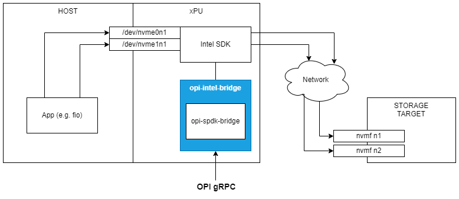

# OPI gRPC to Intel SDK bridge

[](https://github.com/opiproject/opi-intel-bridge/actions/workflows/linters.yml)
[](https://github.com/opiproject/opi-intel-bridge/actions/workflows/codeql.yml)
[](https://github.com/opiproject/opi-intel-bridge/actions/workflows/go.yml)
[](https://securityscorecards.dev/viewer/?platform=github.com&org=opiproject&repo=opi-intel-bridge)
[](https://codecov.io/gh/opiproject/opi-intel-bridge)
[](https://goreportcard.com/report/github.com/opiproject/opi-intel-bridge)

[Download 🚀](https://github.com/orgs/opiproject/packages?repo_name=opi-intel-bridge) ·
[Report issue 🐞](https://github.com/opiproject/opi-intel-bridge/issues/new/choose) ·
[Contribute 👋](#i-want-to-contribute)

----

This is an Intel bridge to OPI APIs. Currently it supports storage APIs and is subject to extension for other domains including inventory, ipsec and networking.
The intel-opi-bridge (further bridge) acts as a gRPC server for xPU management and configuration.

The diagram below illustrates main system components of an exemplary NVMe-oF initiator deployment. The bridge (in blue) runs on an xPU and translates OPI API commands to appropriate sequences of Intel SDK instructions. Ultimately, two emulated NVMe storage devices are exposed to the host. These devices are backed by an "over Fabrics"-connection to some remote storage backends while the host has an illusion of accessing locally attached storage and can run standard/unmodified apps/drivers to access it.

\
*Fig. 1 - System components in NVMe-oF scenario*

## Quickstart

This section outlines the basic steps to get you up-and-running with the bridge and shows some examples of its usage to expose storage devices to the host, set bandwidth/rate limiters on them or enable data-at-rest crypto. The steps are mainly executed as gRPC commands to the bridge but may also involve some host-side interactions or initial xPU-side setup.

> **Note** \
It is assumed that Intel IPU is already properly set up to be used with Intel OPI bridge.

The following variables are used throughout this document:

| Variable    | Description                                                                                                                                        |
| ----------- | -------------------------------------------------------------------------------------------------------------------------------------------------- |
| BRIDGE_IP   | opi-intel-bridge gRPC listening IP address e.g. 10.10.10.10 or localhost                                                                           |
| BRIDGE_PORT | opi-intel-bridge gRPC listening port e.g. 50051                                                                                                    |
| BRIDGE_ADDR | BRIDGE_IP:BRIDGE_PORT                                                                                                                              |
| NVME_PF_BDF | physical function PCI address e.g. 0000:3b:00.1 for Nvme                                                                                           |
| NVME_VF_BDF | virtual function PCI address e.g. 0000:40:00.0 can be found in pf's virtfn\<X\> where X equals to virtual_function in CreateNvmeController minus 1 |
| BLK_PF_BDF  | physical function PCI address e.g. 0000:af:01.0 for virtio-blk                                                                                     |
| TARGET_IP   | storage target ip address                                                                                                                          |
| TARGET_PORT | storage target port                                                                                                                                |

### Build and import

To build the solution execute

```bash
go build -v -o /opi-intel-bridge ./cmd/...
```

To import the bridge within another go package or module use

```go
import "github.com/opiproject/opi-intel-bridge/pkg/frontend"
import "github.com/opiproject/opi-intel-bridge/pkg/middleend"
```

### Usage

On xPU run

```bash
$ docker run --rm -it -v /var/tmp/:/var/tmp/ -p $BRIDGE_PORT:$BRIDGE_PORT ghcr.io/opiproject/opi-intel-bridge:main

2023/07/03 11:04:30 Connection to SPDK will be via: unix detected from /var/tmp/spdk.sock
2023/07/03 11:04:30 server listening at [::]:50051
```

To send commands to the bridge, grpc_cli tool is used. It can be used as a containerized or a native version. If containerized version is preferable, then an alias can be defined as follows

```bash
alias grpc_cli="docker run --network=host --rm -it namely/grpc-cli"
```

On management machine run below command to check bridge availability and reflection capabilities

```bash
$ grpc_cli ls --json_input --json_output $BRIDGE_ADDR

grpc.reflection.v1alpha.ServerReflection
opi_api.inventory.v1.InventorySvc
opi_api.security.v1.IPsec
opi_api.storage.v1.AioControllerService
opi_api.storage.v1.FrontendNvmeService
opi_api.storage.v1.FrontendVirtioBlkService
opi_api.storage.v1.FrontendVirtioScsiService
opi_api.storage.v1.MiddleendEncryptionService
opi_api.storage.v1.MiddleendQosVolumeService
opi_api.storage.v1.NvmeRemoteControllerService
opi_api.storage.v1.NullDebugService
```

or specify commands manually

```bash
# Nvme PF creation
grpc_cli call --json_input --json_output $BRIDGE_ADDR CreateNvmeSubsystem "{nvme_subsystem : {spec : {nqn: 'nqn.2022-09.io.spdk:opitest2', serial_number: 'myserial2', model_number: 'mymodel2', max_namespaces: 11} }, nvme_subsystem_id : 'subsystem2' }"
grpc_cli call --json_input --json_output $BRIDGE_ADDR ListNvmeSubsystems "{parent : 'todo'}"
grpc_cli call --json_input --json_output $BRIDGE_ADDR GetNvmeSubsystem "{name : '//storage.opiproject.org/volumes/subsystem2'}"
grpc_cli call --json_input --json_output $BRIDGE_ADDR CreateNvmeController "{nvme_controller : {spec : {nvme_controller_id: 2, subsystem_name_ref : '//storage.opiproject.org/volumes/subsystem2', pcie_id : {physical_function : 0, virtual_function : 0, port_id: 0}, max_nsq:5, max_ncq:5 } }, nvme_controller_id : 'controller1'}"
grpc_cli call --json_input --json_output $BRIDGE_ADDR ListNvmeControllers "{parent : '//storage.opiproject.org/volumes/subsystem2'}"
grpc_cli call --json_input --json_output $BRIDGE_ADDR GetNvmeController "{name : '//storage.opiproject.org/volumes/controller1'}"

# Nvme VF creation on PF0
grpc_cli call --json_input --json_output $BRIDGE_ADDR CreateNvmeSubsystem "{nvme_subsystem : {spec : {nqn: 'nqn.2022-09.io.spdk:opitest3', serial_number: 'mev-opi-serial', model_number: 'mev-opi-model', max_namespaces: 11} }, nvme_subsystem_id : 'subsystem03' }"
grpc_cli call --json_input --json_output $BRIDGE_ADDR CreateNvmeController "{nvme_controller : {spec : {nvme_controller_id: 2, subsystem_name_ref : '//storage.opiproject.org/volumes/subsystem03', pcie_id : {physical_function : 0, virtual_function : 3, port_id: 0 }, max_nsq:5, max_ncq:5 } }, nvme_controller_id : 'controller3'}"

# Connect to storage-target
grpc_cli call --json_input --json_output $BRIDGE_ADDR CreateNvmeRemoteController "{nvme_remote_controller : {multipath: 'NVME_MULTIPATH_MULTIPATH'}, nvme_remote_controller_id: 'nvmetcp12'}"
grpc_cli call --json_input --json_output $BRIDGE_ADDR ListNvmeRemoteControllers "{parent: 'todo'}"
grpc_cli call --json_input --json_output $BRIDGE_ADDR GetNvmeRemoteController "{name: '//storage.opiproject.org/volumes/nvmetcp12'}"
grpc_cli call --json_input --json_output $BRIDGE_ADDR CreateNvmePath "{nvme_path : {controller_name_ref: '//storage.opiproject.org/volumes/nvmetcp12', traddr:'11.11.11.2', subnqn:'nqn.2016-06.com.opi.spdk.target0', trsvcid:'4444', trtype:'NVME_TRANSPORT_TCP', adrfam:'NVME_ADRFAM_IPV4', hostnqn:'nqn.2014-08.org.nvmexpress:uuid:feb98abe-d51f-40c8-b348-2753f3571d3c'}, nvme_path_id: 'nvmetcp12path0'}"
grpc_cli call --json_input --json_output $BRIDGE_ADDR ListNvmePaths "{parent : 'todo'}"
grpc_cli call --json_input --json_output $BRIDGE_ADDR GetNvmePath "{name: '//storage.opiproject.org/volumes/nvmetcp12path0'}"

# Virtio-blk PF creation (virtio-blk requires a volume, that's why it is created after connection to storage-target)
grpc_cli --json_input --json_output call $BRIDGE_ADDR CreateVirtioBlk "{virtio_blk_id: 'virtioblk0', virtio_blk : { volume_name_ref: 'nvmetcp12n0', pcie_id: { physical_function: '0', virtual_function: '0', port_id: '0'}}}"

# Create QoS volume
grpc_cli call --json_input --json_output $BRIDGE_ADDR CreateQosVolume "{'qos_volume' : {'volume_name_ref' :'nvmetcp12n1', 'limits' : { 'max': {'rw_iops_kiops': 3} } }, 'qos_volume_id' : 'qosnvmetcp12n1' }"

# Create encrypted volume
grpc_cli call --json_input --json_output $BRIDGE_ADDR CreateEncryptedVolume "{'encrypted_volume': { 'cipher': 'ENCRYPTION_TYPE_AES_XTS_128', 'volume_name_ref': 'nvmetcp12n1', 'key': 'MDAwMTAyMDMwNDA1MDYwNzA4MDkwYTBiMGMwZDBlMGY='}, 'encrypted_volume_id': 'encnvmetcp12n1' }"

# Create namespace
grpc_cli call --json_input --json_output $BRIDGE_ADDR CreateNvmeNamespace "{nvme_namespace : {spec : {subsystem_name_ref : '//storage.opiproject.org/volumes/subsystem2', volume_name_ref : 'nvmetcp12n1', 'host_nsid' : '10', uuid:{value : '1b4e28ba-2fa1-11d2-883f-b9a761bde3fb'}, nguid: '1b4e28ba-2fa1-11d2-883f-b9a761bde3fb', eui64: 1967554867335598546 } }, nvme_namespace_id: 'namespace1'}"
grpc_cli call --json_input --json_output $BRIDGE_ADDR ListNvmeNamespaces "{parent : '//storage.opiproject.org/volumes/subsystem2'}"
grpc_cli call --json_input --json_output $BRIDGE_ADDR GetNvmeNamespace "{name : '//storage.opiproject.org/volumes/namespace1'}"
grpc_cli call --json_input --json_output $BRIDGE_ADDR StatsNvmeNamespace "{name : '//storage.opiproject.org/volumes/namespace1'}"

# Delete namespace
grpc_cli call --json_input --json_output $BRIDGE_ADDR DeleteNvmeNamespace "{name : '//storage.opiproject.org/volumes/namespace1'}"

# Delete encrypted volume
grpc_cli call --json_input --json_output $BRIDGE_ADDR DeleteEncryptedVolume "{'name': '//storage.opiproject.org/volumes/encnvmetcp12n1'}"

# Delete QoS volume
grpc_cli call --json_input --json_output $BRIDGE_ADDR DeleteQosVolume "{name : '//storage.opiproject.org/volumes/qosnvmetcp12n1'}"

# Delete virtio-blk PF
grpc_cli call --json_input --json_output $BRIDGE_ADDR DeleteVirtioBlk "{ name: '//storage.opiproject.org/volumes/virtioblk0'}"

# Disconnect from storage-target
grpc_cli call --json_input --json_output $BRIDGE_ADDR DeleteNvmePath "{name: '//storage.opiproject.org/volumes/nvmetcp12path0'}"
grpc_cli call --json_input --json_output $BRIDGE_ADDR DeleteNvmeRemoteController "{name: '//storage.opiproject.org/volumes/nvmetcp12'}"

# Delete Nvme VF
grpc_cli call --json_input --json_output $BRIDGE_ADDR DeleteNvmeController "{name : '//storage.opiproject.org/volumes/controller3'}"
grpc_cli call --json_input --json_output $BRIDGE_ADDR DeleteNvmeSubsystem "{name : '//storage.opiproject.org/volumes/subsystem03'}"

# Delete Nvme PF
grpc_cli call --json_input --json_output $BRIDGE_ADDR DeleteNvmeController "{name : '//storage.opiproject.org/volumes/controller1'}"
grpc_cli call --json_input --json_output $BRIDGE_ADDR DeleteNvmeSubsystem "{name : '//storage.opiproject.org/volumes/subsystem2'}"
```

To observe Nvme devices on host:

After PF is created

```bash
# Bind driver to PF
modprobe nvme
cd /sys/bus/pci/devices/$NVME_PF_BDF
echo 'nvme' > ./driver_override
echo $NVME_PF_BDF > /sys/bus/pci/drivers/nvme/bind

# Allocate resources and prepare for VF creation
echo 0 > ./sriov_drivers_autoprobe
echo 4 > ./sriov_numvfs
```

After VF is created

```bash
cd /sys/bus/pci/devices/$NVME_PF_BDF
echo 'nvme' > ./virtfn0/driver_override
echo $NVME_VF_BDF > /sys/bus/pci/drivers/nvme/bind
```

Before VF is deleted

```bash
cd /sys/bus/pci/devices/$NVME_PF_BDF
echo $NVME_VF_BDF > /sys/bus/pci/drivers/nvme/unbind
echo '(null)' > ./virtfn2/driver_override
```

Before PF is deleted

```bash
cd /sys/bus/pci/devices/$NVME_PF_BDF
echo $NVME_PF_BDF > /sys/bus/pci/drivers/nvme/unbind
echo '(null)' > ./driver_override
```

To observe Virtio-blk devices on host:

After PF is created

```bash
echo 1 > /sys/bus/pci/devices/$BLK_PF_BDF/remove
echo 1 > /sys/bus/pci/rescan
```

### Mutual TLS setup

In order to pass configuration data to the xPU securely and only by authenticated/allowed clients it is recommended to secure the gRPC port with mutual TLS.

> **Warning** \
The steps outlined below use self-signed certificates and serve only demonstration purposes. It is up to the integrator of the solution to securely provision the keys and certificates to the server and follow up-to-date crypto recommendations, e.g. [NIST TLS Guidelines](https://csrc.nist.gov/publications/detail/sp/800-52/rev-2/final) and [NIST Cryptographic Standards and Guidelines](https://csrc.nist.gov/Projects/Cryptographic-Standards-and-Guidelines).

The following variables are used in the instructions below:

| Variable    | Description                                                                         |
| ----------- | ----------------------------------------------------------------------------------- |
| SAN_IP      | subject alternative name in form of ip address e.g. 10.10.10.10 for TLS certificate |
| SERVER_CERT | server certificate file path e.g. /etc/opi/server-cert.pem                          |
| SERVER_KEY  | server key file path e.g. /etc/opi/server-key.pem                                   |
| CA_CERT     | server CA certificate file path e.g. /etc/opi/ca-cert.pem                           |
| CLIENT_CERT | client certificate file path e.g. /etc/opi/client-cert.pem                          |
| CLIENT_KEY  | client key file path e.g. /etc/opi/client-key.pem                                   |

#### Generate certificates/keys

This section describes how to generate TLS self-signed certificates. The root level Certificate Authority (CA) is used to generate server-side key and cert files, and client-side key and cert files. This results in a 1-depth level certificate chain, which will suffice for verification and validation purposes but may not provide sufficient security for production systems. It is highly recommended to use well-known CAs, and generate certificates at multiple depth levels in order to conform to higher security standards.

```bash
# create config files
echo "subjectAltName=IP:$SAN_IP" > server-ext.cnf
echo "subjectAltName=IP:$SAN_IP" > client-ext.cnf
# generate CA certificate
openssl req -x509 -newkey rsa:4096 -days 365 -nodes -keyout ca-key.pem -out ca-cert.pem -sha384
# generate server private key and signing request
openssl req -newkey rsa:4096 -nodes -keyout server-key.pem -out server-req.pem -sha384
# use CA's private key to get signed server certificate
openssl x509 -req -in server-req.pem -days 365 -CA ca-cert.pem -CAkey ca-key.pem -CAcreateserial -out server-cert.pem -extfile server-ext.cnf
# generate client private key and signing request
openssl req -newkey rsa:4096 -nodes -keyout client-key.pem -out client-req.pem -sha384
# use CA's private key to get signed client certificate
openssl x509 -req -in client-req.pem -days 365 -CA ca-cert.pem -CAkey ca-key.pem -CAcreateserial -out client-cert.pem -extfile client-ext.cnf
```

copy server related certificates/keys to a dedicated secure location on xPU

```bash
mkdir /etc/opi
cp server-cert.pem /etc/opi
cp server-key.pem /etc/opi
cp ca-cert.pem /etc/opi
```

make sure to follow the principle of least privilege for access permissions and change ownership to a dedicated user.

##### Run server

Run bridge binary specifying TLS-related server key/certificate and CA cert

```bash
./opi-intel-bridge -tls $SERVER_CERT:$SERVER_KEY:$CA_CERT
```

for container

```bash
docker run --network=host -v "/var/tmp:/var/tmp" -v "/etc/opi:/etc/opi" ghcr.io/opiproject/opi-intel-bridge:main /opi-intel-bridge -port=$BRIDGE_PORT -tls $SERVER_CERT:$SERVER_KEY:$CA_CERT
```

##### Send client commands

To send by means of not-containerized grpc_cli:

```bash
GRPC_DEFAULT_SSL_ROOTS_FILE_PATH="$CA_CERT" grpc_cli --json_input --json_output --channel_creds_type=ssl --ssl_client_cert="$CLIENT_CERT" --ssl_client_key="$CLIENT_KEY" call $BRIDGE_ADDR ListAioControllers "{}"
```

## I Want To Contribute

This project welcomes contributions and suggestions.  We are happy to have the Community involved via submission of **Issues and Pull Requests** (with substantive content or even just fixes). We are hoping for the documents, test framework, etc. to become a community process with active engagement.  PRs can be reviewed by any number of people, and a maintainer may accept.

See [CONTRIBUTING](https://github.com/opiproject/opi/blob/main/CONTRIBUTING.md) and [GitHub Basic Process](https://github.com/opiproject/opi/blob/main/doc-github-rules.md) for more details.

For reporting security vulnerabilities see [SECURITY.md](https://github.com/opiproject/opi-intel-bridge/blob/main/SECURITY.md).
